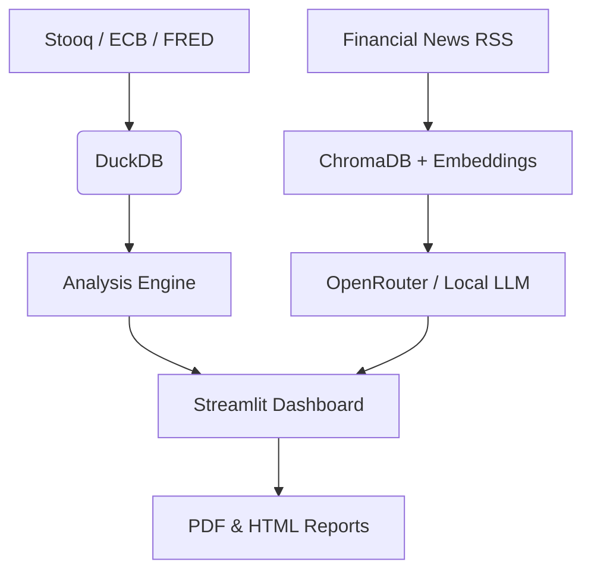
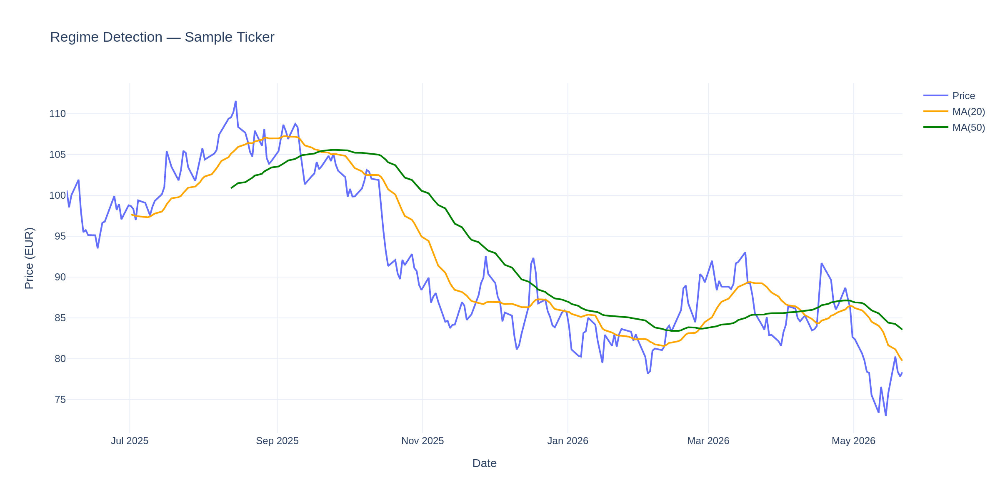
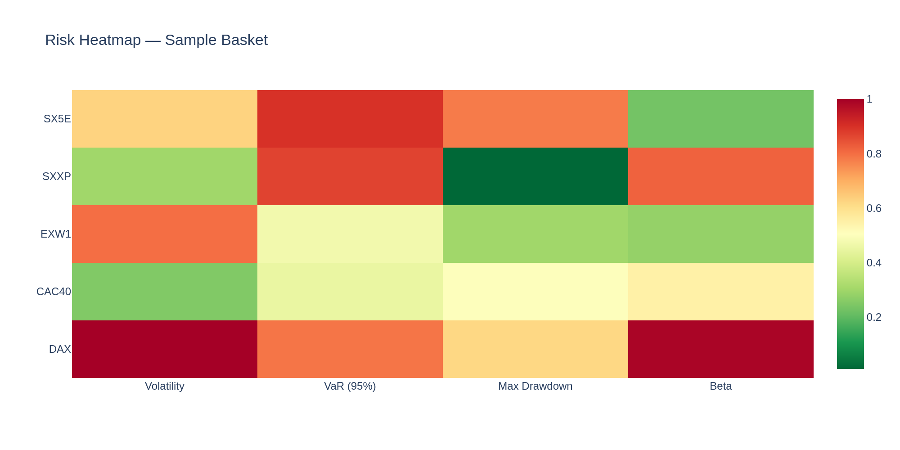
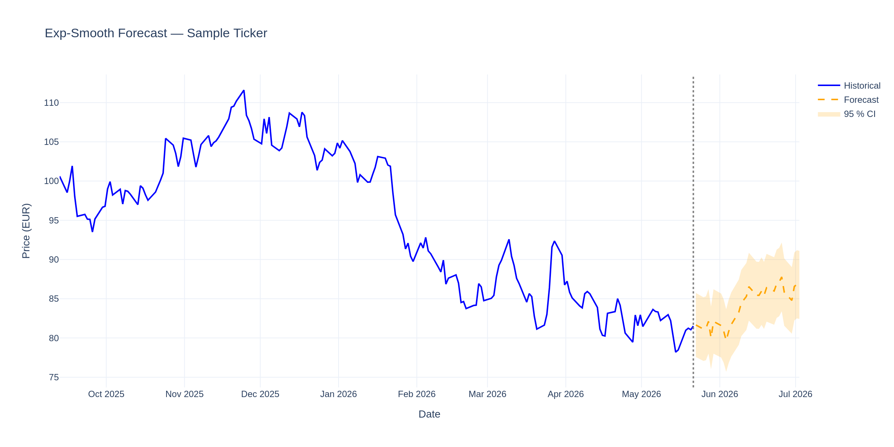

# 🇪🇺 EuroPulse — European Financial Intelligence Platform

A modular, RAG-powered dashboard that fetches European price data, macro indicators (FRED / ECB), and financial news, then synthesises everything into an LLM-generated executive summary with risk alerts.

[](https://your-streamlit-url.streamlit.app)

## Architecture



## Key Features

- **Multi-source ingestion** — Stooq price data, ECB interest rates, FRED macro series (CPI, unemployment, GDP), Polish National Bank (NBP) exchange rates
- **RAG pipeline** — ChromaDB vector store with sentence-transformer embeddings, news deduplication, and LLM synthesis via OpenRouter (or local Ollama fallback)
- **Analysis engine** — RSI, Bollinger Bands, rolling volatility, VaR, Sharpe ratio, regime detection, exponential-smoothing forecast
- **Risk alerts** — Threshold-based RSI and volatility alerts with optional Slack / Discord webhook dispatch
- **Reporting** — Jinja2 + Plotly HTML reports and WeasyPrint PDF generation
- **Interactive dashboard** — Streamlit with price charts, macro overlays, risk heatmaps, forecast bands, and LLM chat interface
- **Incremental ETL** — `--incremental` flag fetches only new data since the last DB max date
- **Retry resilience** — Tenacity-backed HTTP retry on 429/5xx and transient network errors

## Quickstart

```bash
# Clone
git clone https://github.com/EliaszDev/Europulse.git
cd Europulse

# Create virtual environment
python3 -m venv .venv
source .venv/bin/activate

# Install dependencies
pip install -e ".[dev]"

# Configure environment
cp .env.example .env
# Edit .env — add FRED_API_KEY and OPENROUTER_API_KEY

# Initialise database
python -c "from europulse.ingestion.db import get_conn, create_schema; create_schema(get_conn())"

# Run full backfill
python scripts/ingest_all.py --backfill

# Launch dashboard
streamlit run europulse/ui/app.py
```

### Hardware Notes

- **CPU only** — all inference defaults to OpenRouter cloud LLMs; local Ollama is optional
- **RAM** — ~4 GB sufficient for DuckDB + ChromaDB + sentence-transformers (`all-MiniLM-L6-v2`)
- **Disk** — ~2 GB for 2 years of daily price + macro data, embeddings, and report cache
- **GPU** — not required; PyTorch CPU wheels are used by default

## Why European Finance?

EuroPulse is built to surface macro-financial signals relevant to European institutional investors, Luxembourg-domiciled funds, and EIB project finance desks:

- **Luxembourg** — the EU's largest investment-fund centre; fund managers need real-time EUR-denominated risk metrics and macro overlays
- **European Investment Bank (EIB)** — the EU's lending arm monitors EUR-area CPI, ECB rates, and sovereign spreads to price project-finance risk
- **Coverage** — SX5E (Euro Stoxx 50), SXXP (Stoxx Europe 600), DAX, CAC 40, and EUR macro series provide a representative European basket

## Screenshots

| Regime Detection | Risk Heatmap | Forecast |
|---|---|---|
|  |  |  |

*Chat interface and full sample report are available in the live Streamlit demo.*

## Roadmap

| Milestone | Status | Key Deliverables |
|---|---|---|
| Week 1 — Data Ingestion | ✅ | Stooq/FRED/ECB fetchers, DuckDB schema, incremental upserts |
| Week 2 — Analysis Engine | ✅ | RSI, Bollinger, VaR, Sharpe, regime detection, exp-smooth forecast |
| Week 3 — RAG Pipeline | ✅ | News fetcher, ChromaDB embeddings, ticker tagging, LLM synthesis |
| Week 4 — Reporting & Dashboard | ✅ | Jinja2/Plotly HTML, WeasyPrint PDF, Streamlit UI |
| Week 5 — LLM Switching & Context | ✅ | OpenRouter + Ollama fallback, prompt caching, streaming chat |
| Week 6 — Hard Reset & Retry Logic | ✅ | Tenacity retry wrapper, `since` params for incremental ingestion, report DB logging |
| Week 7 — Polish & Deployment | ✅ | README rewrite, `.streamlit/config.toml`, screenshot assets, NBP fetcher, webhook alerts |

### Future Ideas

- FinBERT sentiment scoring on news articles
- Luxembourg Stock Exchange (LuxSE) tickers
- FastAPI alert webhook server with retry logic

## Requirements

- Python ≥ 3.11
- See `pyproject.toml` for full dependency list
- Chrome / Chromium only required for `scripts/generate_screenshots.py` (dev dependency `kaleido` bundles it)

## License

MIT © EliaszDev
